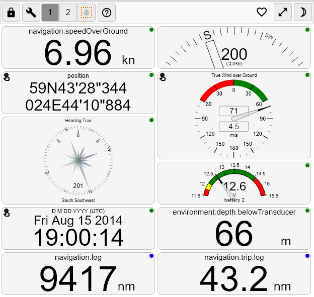

Signal K Instrument Panel
=========================
Instrument panel implemented as a grid with draggable &amp; resizable components. Components are added dynamically eg.
when the panel receives data it hasn't seen before a new cell is added to the grid.

Online demo: [http://demo.signalk.org/@signalk/instrumentpanel](http://demo.signalk.org/@signalk/instrumentpanel)  
InstrumentPanel help: [http://demo.signalk.org/@signalk/instrumentpanel#help](http://demo.signalk.org/@signalk/instrumentpanel#help)  

Trouble?
========
First consult the online help, link above or click on **?** icon inside the GUI.  
InstrumentPanel stores some of the settings in the browser's localstorage. In case there is some garbage there you can
get it cleared by using a url with query parameter `?reset=true`.  
The units and labels are also stored in the browser's localstorage and fetched from the signalK's server only the first time.
If you change a unit or a display label on the server, you can clear the cache without destroying your layout by using a url with query parameter  `?flushCache=true`.  
You can also clear the cache using the dedicated menu in the GUI

For iOS user:
=============
On an unlocked grid, to drag or to resize a widget,
 first click once or twice in the center of the widget
 to bring focus to it and then you can drag or resize the widget with the screen's scroll locked.  
If you don't click first in the center of the widget,
 the page starts scrolling before you can drag or resize the widget.  
To scroll the grid, it's easiest to do it from the left side even
 if the vertical scroll bar is to the right side.  
Using the vertical scrollbar on the right side,
 you risk resizing a widget instead of scrolling the page.  

For Developers
==============
- clone repository: `git clone https://github.com/SignalK/instrumentpanel.git`
- install development dependencies with: `npm install`
- build & watch with: `npm start` (run an instrumentpanel http server on port 3001)
- building js bundle for distribution: `npm run prepublishOnly` will publish in `public\ui.js`. This builds minified ui.js.
  
The address of the signal K server is directly derived from your web page.  
You can manually specify the address and the protocol to connect to your signal K server.  
Be careful if you mix secure and unsecured protocols, your browser may refuse the connection.  
To manually specify the address and the protocol of the signal K server,  
 add the following query parameter **?signalkServer=wss://mysignalk.local:3443** to the url.  
Use **wss://** for secure websocket or **ws://** for unsecure websocket.  

Changelog
=====
[CHANGELOG](CHANGELOG.md)

To Do
=====
- [ ] import/export grid configuration on Signal K server
- [ ] multiple look & feel by css choice
- [ ] remote control of tabs
- [ ] history graph widget (simple)
- [ ] subscription support: fetch items list from server, only subscribe when widget activated
- [ ] sailgauge widget like http://navgauge.herokuapp.com/
- [ ] possibility to delete obsolete data items
- [ ] manual addition of widgets, multiple alternative widgets
- [ ] temporary full screen mode for one widget
- [ ] history graph widget (maybe https://github.com/mapbox/react-tangle for scaling)
- [ ] ais tracker widget
- [ ] map widget
- [ ] bootstrapping from server for history graph
- [ ] Being able to delete a useless widget
- [x] 'discovery mode' manual activation/deactivation
- [x] dark mode support
- [x] dedicated notifications tab
- [x] activate/deactivate individual widgets
- [x] connect to multiple servers
- [x] minify
- [x] react-grid-styles: bower packaging
- [x] 'Receiving indicator' (circle/circle-o)
- [x] visible grid cell background
- [x] per server layout persisted in localstorage
- [x] last known servers & connection status in localstorage
- [x] good widgets for 'normal' data set (position, current, date & time)
- [x] true/both values in windmeter, change by click
- [x] alternative/configurable units (knots/mps/mph)
- [x] configurable display format (position: deg+min.dec, deg.min.sec / precision)
- [x] online help in GUI
- [x] configuration mode for widgets
- [x] multiple alternate layouts called by query parameter ?layout=myLayoutName
- [x] ui cleanup...
